# Mermaid / PlantUML サンプル

注文管理システムを題材にした Mermaid と PlantUML の総合サンプル集です。共通図は各図ごとに Mermaid、PlantUML の順で記載しています。

## 共通 UML 相当図

### ユースケース図
ユーザーや外部アクターと、システムが提供する機能の関係を表します。MermaidのflowchartにはUML専用のアクター記号がないため、外側に丸角ノードとして表現します。

- Mermaid
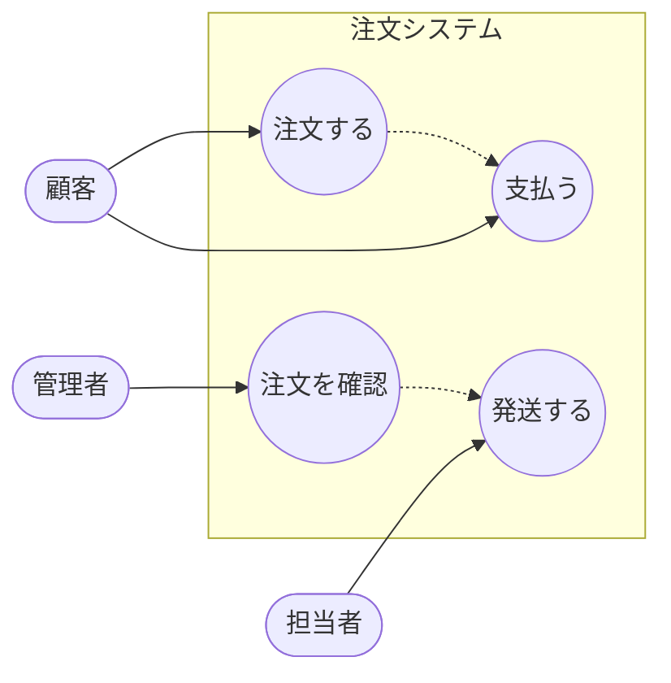

- PlantUML
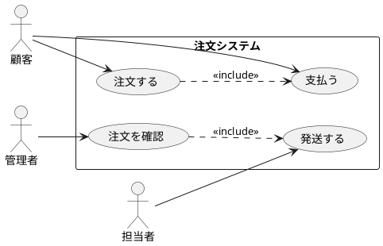

### シーケンス図
処理の時間的な流れと、登場するオブジェクト間のメッセージを表します。

- Mermaid
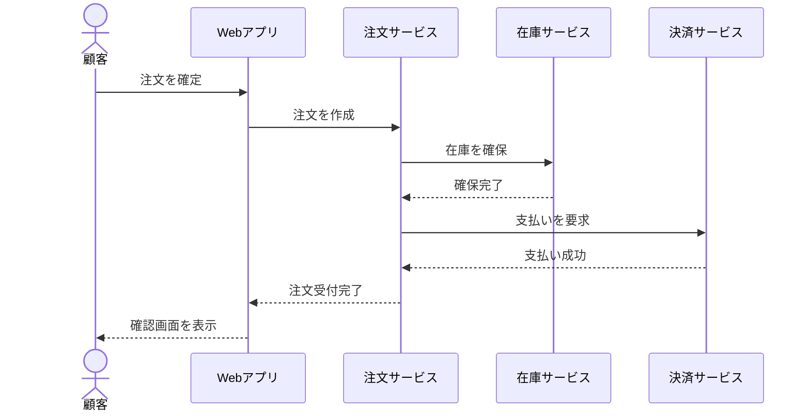

- PlantUML
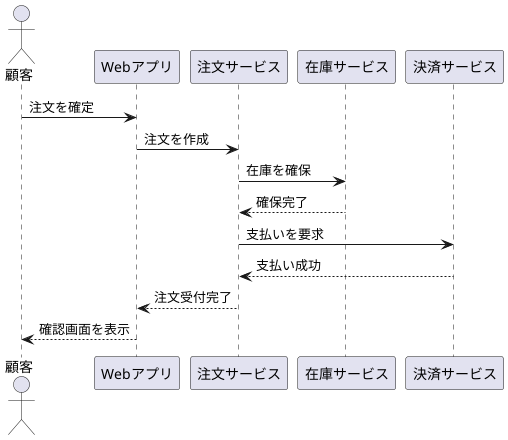

### クラス図
クラス、属性、操作、クラス間の関係など、システムの静的構造を表します。

- Mermaid
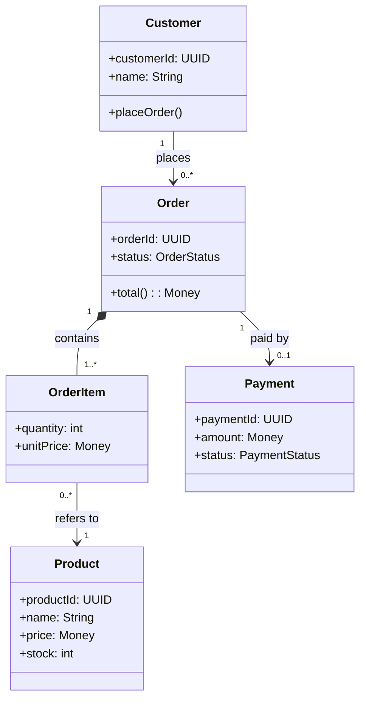

- PlantUML
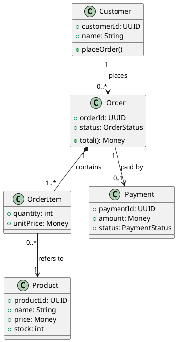

### アクティビティ図
業務や処理の流れ、分岐、並行処理などを表します。

- Mermaid
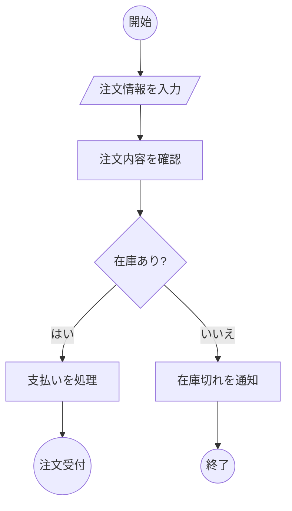

- PlantUML
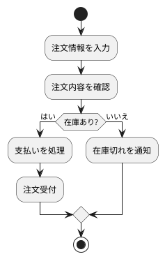

### ステートマシン図
オブジェクトの状態と、イベントによる状態遷移を表します。

- Mermaid
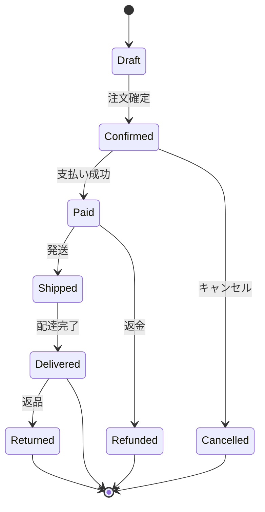

- PlantUML
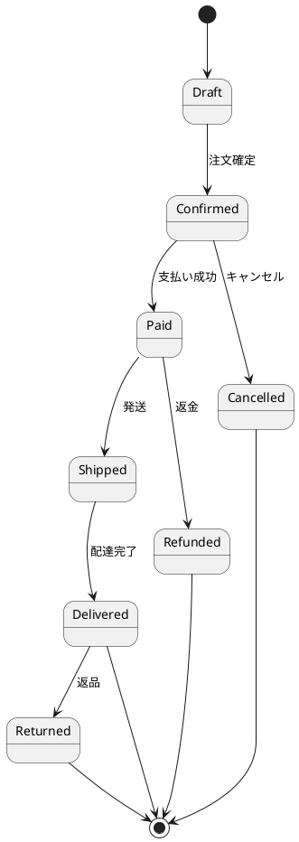

### ER 図
データベースのエンティティ、属性、関連、多重度を表します。

- Mermaid
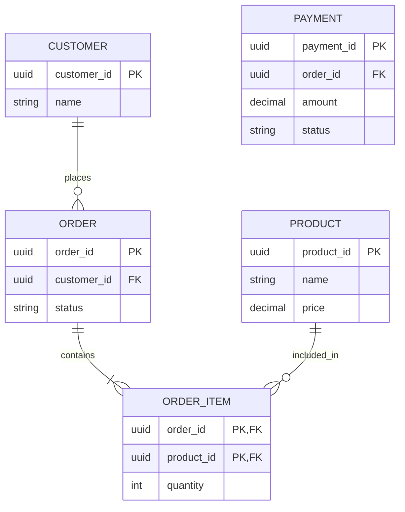

- PlantUML
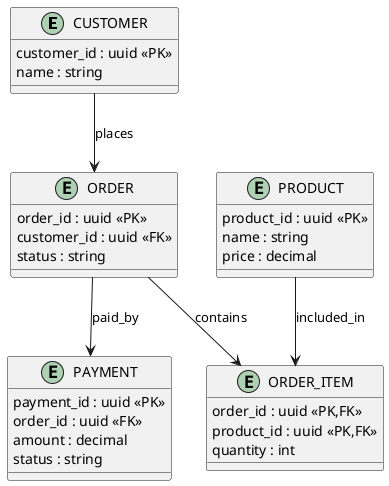

### コンポーネント図
システムを構成するソフトウェア部品と、その依存関係を表します。

- Mermaid（互換表現）
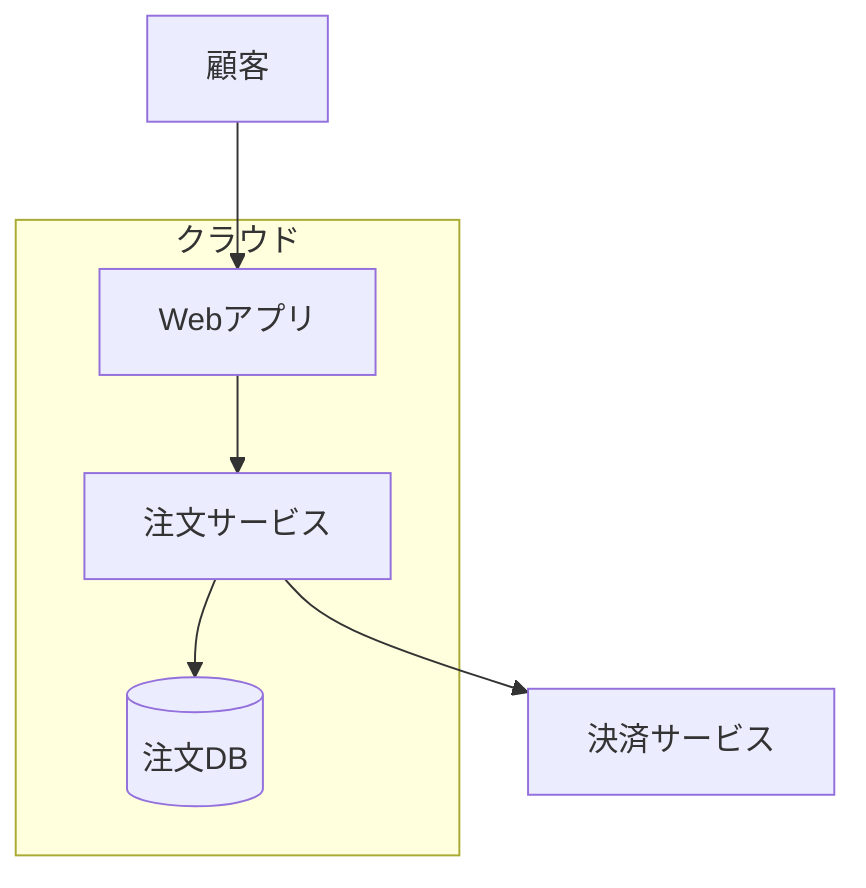

- PlantUML
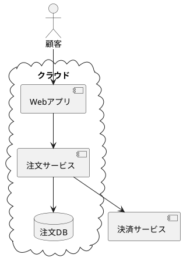

### 配置図
ソフトウェア部品が、どのサーバーや実行環境に配置されるかを表します。

- Mermaid（互換表現）
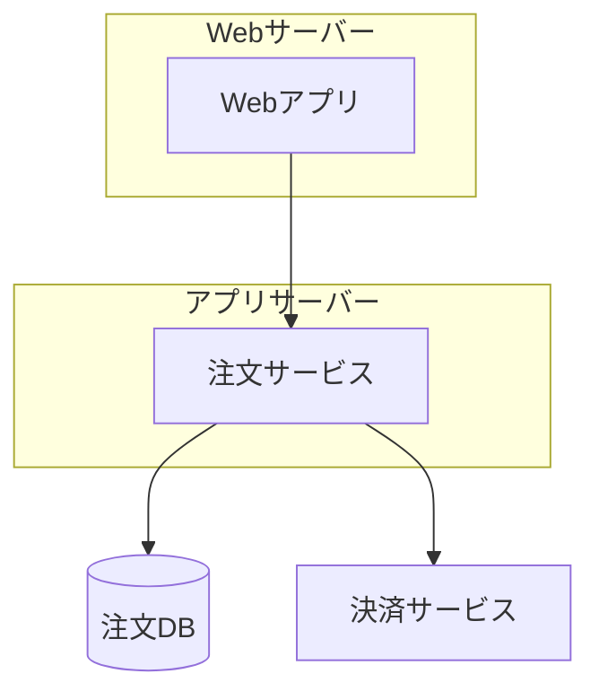

- PlantUML
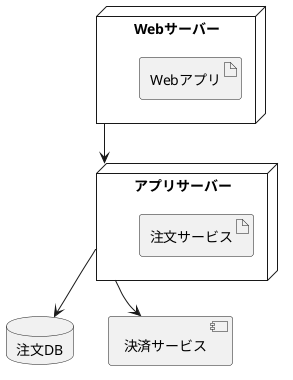

### ガントチャート
作業の期間、順序、依存関係を時系列で表します。

- Mermaid
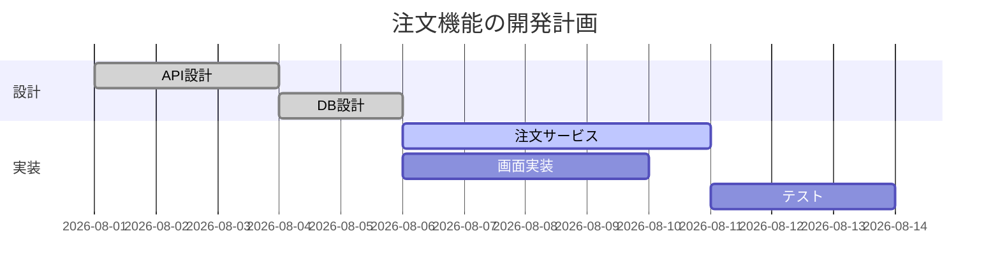

- PlantUML
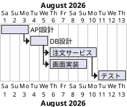

### ファイルツリー
プロジェクトのディレクトリ構成と、主要なファイルの配置を表します。

- Mermaid（互換表現）
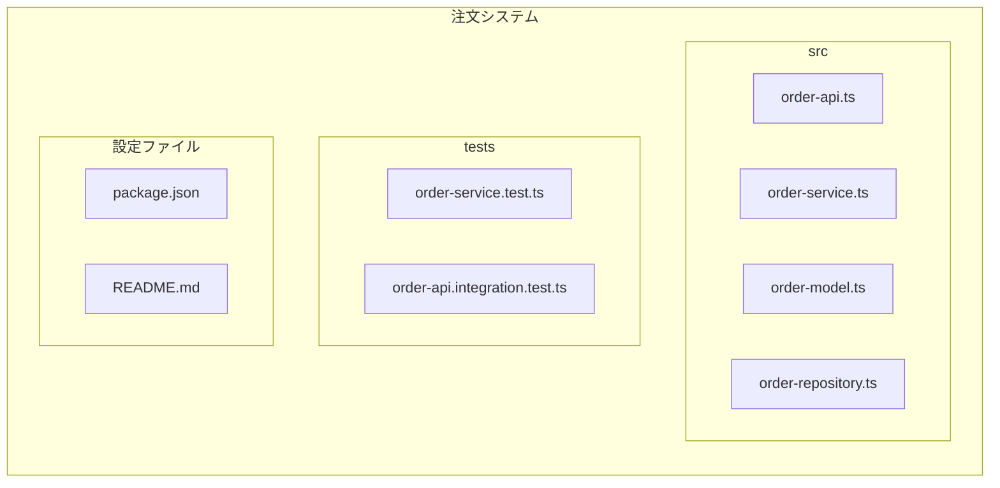

- PlantUML
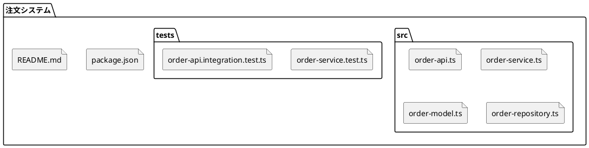

### フローチャート
入力、判断、処理、エラーなどの基本的な処理の流れを表します。

- Mermaid
```mermaid
flowchart LR
    input[/入力/]
    valid{検証}
    auth{認証済み?}
    save[(DB)]
    error[/エラー/]
    input --> valid
    valid -->|成功| auth
    valid -->|失敗| error
    auth -->|はい| save
    auth -->|いいえ| error
```

- PlantUML（互換表現）
```plantuml
@startuml
start
:入力;
:検証;
if (検証成功?) then (はい)
  if (認証済み?) then (はい)
    :DBへ保存;
  else (いいえ)
    :エラー;
  endif
else (いいえ)
  :エラー;
endif
stop
@enduml
```

## 共通比較（互換表現を含む）

### マインドマップ
情報やアイデアを中心テーマから階層的に整理します。

- Mermaid
```mermaid
mindmap
  root((注文システム))
    顧客
      登録
      注文履歴
    注文
      商品
      支払い
      配送
```

- PlantUML
```plantuml
@startmindmap
* 注文システム
** 顧客
*** 登録
*** 注文履歴
** 注文
*** 商品
*** 支払い
*** 配送
@endmindmap
```

### スイムレーン
担当者や部門ごとの責任範囲を分けて、業務フローを表します。

- Mermaid（互換表現）
```mermaid
flowchart LR
    subgraph 顧客
      request[注文する]
      receive[受付を確認]
    end
    subgraph 店舗
      check[在庫を確認]
      pack[商品を梱包]
    end
    subgraph 配送会社
      ship[商品を発送]
    end
    request --> check --> pack --> ship --> receive
```

- PlantUML（互換表現）
```plantuml
@startuml
|顧客|
start
:注文する;
|店舗|
:在庫を確認;
:商品を梱包;
|配送会社|
:商品を発送;
|顧客|
:受付を確認;
stop
@enduml
```

### 要求図
要求と、それを満たすシステム要素や検証方法の関係を表します。

- Mermaid（互換表現）
```mermaid
flowchart LR
    orderApi[注文API]
    orderReq[REQ-001: 注文を登録できること]
    orderApi -->|satisfies| orderReq
```

- PlantUML（互換表現）
```plantuml
@startuml
rectangle "REQ-001\n注文を登録できること" as orderReq
component "注文API" as orderApi
orderApi ..> orderReq : satisfies
@enduml
```

### C4
システム、利用者、外部サービスの関係を段階的に整理します。

- Mermaid（互換表現）
```mermaid
flowchart LR
    customer[顧客]
    shop[注文システム]
    payment[決済サービス]
    customer -->|注文する| shop
    shop -->|支払いを依頼| payment
```

- PlantUML（互換表現）
```plantuml
@startuml
actor 顧客 as customer
rectangle 注文システム as shop
rectangle 決済サービス as payment
customer --> shop : 注文する
shop --> payment : 支払いを依頼
@enduml
```

### Sankey
量の流れや、ある入口から複数の出口へ分岐する過程を表します。

- Mermaid（互換表現）
```mermaid
flowchart LR
    customer[顧客] -->|100| products[商品一覧]
    products -->|70| cart[カート]
    products -->|30| leave[離脱]
    cart -->|55| purchase[購入]
    cart -->|15| leave
```

- PlantUML（互換表現）
```plantuml
@startuml
rectangle 顧客 as customer
rectangle 商品一覧 as products
rectangle カート as cart
rectangle 購入 as purchase
rectangle 離脱 as leave
customer --> products : 100
products --> cart : 70
products --> leave : 30
cart --> purchase : 55
cart --> leave : 15
@enduml
```

### XY チャート
数値の推移や、複数の項目間の関係を表します。

- Mermaid（互換表現）
```mermaid
flowchart LR
    title[月別注文数]
    jan[1月: 42] --> feb[2月: 58] --> mar[3月: 71] --> apr[4月: 83]
```

- PlantUML（互換表現）
```plantuml
@startuml
rectangle "1月: 42" as jan
rectangle "2月: 58" as feb
rectangle "3月: 71" as mar
rectangle "4月: 83" as apr
jan --> feb
feb --> mar
mar --> apr
@enduml
```

### ブロック図
大きな機能や構成要素をブロックとして整理します。

- Mermaid（互換表現）
```mermaid
flowchart TB
    web[Web] --> gateway[API Gateway]
    gateway --> auth[認証サービス]
    gateway --> order[注文サービス]
    order --> pay[決済サービス]
    order --> db[(注文DB)]
    order --> cache[(Redisキャッシュ)]
    pay --> provider[外部決済]
```

- PlantUML（互換表現）
```plantuml
@startuml
rectangle Web
rectangle "API Gateway" as Gateway
rectangle "認証サービス" as Auth
rectangle "注文サービス" as Order
rectangle "決済サービス" as Pay
database "注文DB" as DB
database "Redisキャッシュ" as Cache
rectangle "外部決済" as Provider
Web --> Gateway
Gateway --> Auth
Gateway --> Order
Order --> Pay
Order --> DB
Order --> Cache
Pay --> Provider
@enduml
```

### パケット図
通信パケットやデータのフィールド構成を表します。

- Mermaid（互換表現）
```mermaid
flowchart LR
    version[0-3: Version] --> flags[4-7: Flags] --> length[8-15: Length] --> orderId[16-31: Order ID]
```

- PlantUML（互換表現）
```plantuml
@startuml
rectangle "0-3: Version" as version
rectangle "4-7: Flags" as flags
rectangle "8-15: Length" as length
rectangle "16-31: Order ID" as orderId
version --> flags
flags --> length
length --> orderId
@enduml
```

## Mermaid 固有・拡張図

### ユーザージャーニー
```mermaid
journey
    title 顧客の注文体験
    section 商品選択
      商品を検索: 5: 顧客
      商品を比較: 4: 顧客
    section 購入
      カートに追加: 5: 顧客
      支払い: 3: 顧客
      確認メールを受信: 5: 顧客
```

### 円グラフ
```mermaid
pie title 注文ステータス
    "配送済み" : 55
    "処理中" : 30
    "キャンセル" : 15
```

### 四象限
```mermaid
quadrantChart
    title 商品機能の優先度
    x-axis 低コスト --> 高コスト
    y-axis 低効果 --> 高効果
    quadrant-1 戦略投資
    quadrant-2 クイックウィン
    quadrant-3 保留
    quadrant-4 再検討
    簡易検索: [0.2, 0.8]
    レコメンド: [0.8, 0.9]
    CSV出力: [0.4, 0.3]
```

### Git グラフ
```mermaid
gitGraph
    commit id: "初期実装"
    branch feature/order
    checkout feature/order
    commit id: "注文API"
    checkout main
    commit id: "README更新"
    merge feature/order id: "注文機能を統合"
```

### タイムライン
```mermaid
timeline
    title 注文システムの沿革
    2024 : 要件定義
    2025 : MVPリリース
         : 決済連携
    2026 : 配送追跡を追加
```

## PlantUML 固有・拡張図

### オブジェクト図
```plantuml
@startuml
object customer {
  customerId = "C-001"
  name = "山田太郎"
}
object order {
  orderId = "O-001"
  status = "Paid"
}
customer --> order : places
@enduml
```

### タイミング図
```plantuml
@startuml
robust "注文" as Order
robust "支払い" as Pay
@0
Order is Draft
Pay is Idle
@1
Order is Confirmed
@2
Pay is Paid
@3
Order is Shipped
@enduml
```

### WBS
```plantuml
@startwbs
* 注文機能
** 要件定義
** 設計
*** API
*** DB
*** UI
** 実装
*** 注文サービス
*** 決済連携
** テスト
*** 単体テスト
*** 結合テスト
** リリース
@endwbs
```

### JSON
```plantuml
@startjson
{
  "orderId": "O-001",
  "status": "Paid",
  "items": [
    { "productId": "P-001", "quantity": 2 }
  ]
}
@endjson
```

### YAML
```plantuml
@startyaml
order:
  id: O-001
  status: Paid
  items:
    - product: P-001
      quantity: 2
@endyaml
```

### EBNF
```plantuml
@startebnf
order = customer, { item }, payment ;
item = product, quantity ;
payment = "card" | "bank" ;
@endebnf
```

### Regex
```plantuml
@startregex
^[A-Z]{1,3}-[0-9]{3}$
@endregex
```

### Network / nwdiag
```plantuml
@startnwdiag
network internet {
  address = "203.0.113.0/24";
  web [address = "203.0.113.10"];
}
network private {
  app [address = "10.0.0.10"];
  db [address = "10.0.0.20"];
}
@endnwdiag
```

### Salt（画面モック）
```plantuml
@startsalt
{+
  注文検索 | "O-001" | [検索]
  {#
    ステータス | Paid
    合計 | 12,000円
  }
}
@endsalt
```

### Wireframe
```plantuml
@startsalt
{+
  注文詳細
  {
    顧客名 | 山田太郎
    状態 | Paid
    合計 | 12,000円
  }
  [キャンセル] | [発送する]
}
@endsalt
```

### Archimate
```plantuml
@startuml
!include <archimate/Archimate>
Business_Actor(customer, "顧客")
Business_Service(service, "注文サービス")
Technology_Artifact(db, "注文DB")
Rel_Serving(service, customer, "提供")
Rel_Realization(db, service, "実装")
@enduml
```

### Chronology
```plantuml
@startuml
robust "注文" as Order
concise "支払い" as Payment
@0
Order is Draft
Payment is Idle
@1
Order is Confirmed
Payment is Waiting
@2
Order is Paid
Payment is Paid
@3
Order is Shipped
Payment is Paid
@enduml
```

### 数式（AsciiMath・互換表現）
```plantuml
@startuml
rectangle "total = sum(quantity_i * unitPrice_i)" as formula
@enduml
```

### Information Engineering（IE）
```plantuml
@startuml
entity CUSTOMER {
  customer_id <<key>>
  name
}
entity ORDER {
  order_id <<key>>
  customer_id
}
CUSTOMER ||--o{ ORDER : places
@enduml
```

### Chen 形式 ER（互換表現）
```plantuml
@startuml
entity CUSTOMER {
  customer_id : uuid <<key>>
  name
}
entity ORDER {
  order_id : uuid <<key>>
  status
}
CUSTOMER ||--o{ ORDER : places
@enduml
```

### Chart（PlantUML 1.2026.0+）
```plantuml
@startchart
h-axis [1月, 2月, 3月, 4月]
v-axis "注文数" 0 --> 100
bar "注文数" [42, 58, 71, 83]
@endchart
```

## 表示方法

- Mermaid: Mermaid 対応の Markdown エディタ、または Mermaid Live Editor でコードブロックをレンダリングします。
- PlantUML: `@startuml` から `@enduml`（または各図種の開始・終了タグ）を PlantUML 対応エディタでレンダリングします。

一部の新しい Mermaid 図種や PlantUML の Chart は、利用するバージョンによって未対応の場合があります。
